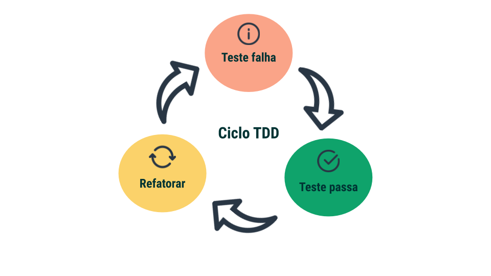

## 7.3: JavaScript ES6 - Fluxos de exceção e Objetos

#### As três dimensões de qualidade
- Confiança: Resistência a falhas, um programa que não quebra com qualquer erro.
- Funcionalidade: O programa entrega o que é proposto.
- Performance: Bom rendimento e desempenho quando volume de processamento é alto.

#### Testes unitários

> Como definido no Course da Trybe:
> "(...) entende-se como **unidade funcional** qualquer porção de código que, através de algum estímulo, seja capaz de gerar um comportamento esperado."

Um teste unitário age sobre uma unidade funcional. O objetivo é prever e então prevenir possíveis erros que podem ser causadas por alterações do que é *esperado*.

#### TDD: Test Driven Development

> Ciclo TDD - inspirado no artigo de Kent Dodds - imagem retirada do Course da Trybe

##### [Voltar](https://github.com/nnnnadia/trybe-exercicios#bloco-7-introdu%C3%A7%C3%A3o-%C3%A0-javascript-es6-e-testes-unit%C3%A1rios)
