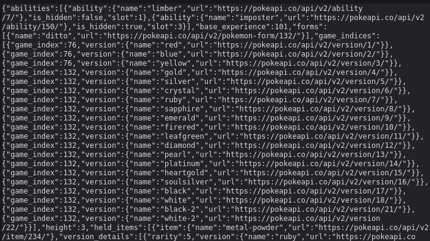
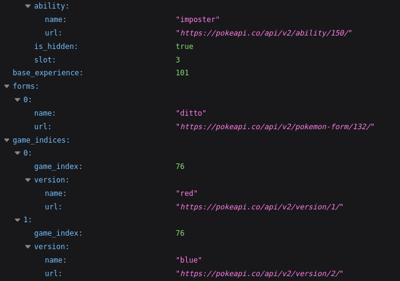
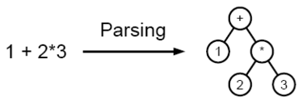

## Application Programming Interface (API)

### Definição
APIs são funcionalidades de programação que nos permitem manipular aspectos do browser e do SO que o site está rodando, como também manipular dados de outros sites ou serviços.

Na prática são constructos disponíveis na programação para que desenvolvedores possam criar funcionalidades complexas facilmente (por exemplo, métodos, propriedades, eventos e URLs)

### Como as APIs funcionam?
Cada API funciona de forma ligeiramente diferente, mas geralmente elas têm em comum funcionalidades e similar temas em como funcionam.

#### São baseadas em objetos
O seu código interage com a API usando um ou mais objetos JavaScript, que servem como contêineres para os dados que a API (contidos em *object properties*) usam e as funcionalidades que a API deixa disponível (contidos em *object methods*).

> Trechos retirados e traduzidos do MDN [:page_facing_up:](https://developer.mozilla.org/en-US/docs/Learn/JavaScript/Client-side_web_APIs/Introduction):point_left:.

### O que é JSON e por que usamos?
JSON ou **J**ava**S**cript **O**bject **N**otation é uma forma de representar dados como objetos JavaScript.

> "JSON está sempre presente em aplicações web modernas, pois é simples, interpretável e ainda funciona muito bem em aplicações JavaScript. Além disso, é compatível com diversas outras linguagens, que conseguem interpretá-lo e gerar códigos no formato, como Python, Java, PHP, Ruby, entre outras. Desse modo, as APIs retornam os dados no formato JSON, a fim de manter uma alta escalabilidade e independência."
> 
> Trecho retirado do Course da Trybe.

Apesar do nome o JSON não é um objeto nativo do JavaScript, mas temos um objeto *built-in* com métodos para lidar com a análise sintática (*parsing*) do JSON e para converter valores no mesmo.

Imagine que queremos utilizar uma API, visitando o link temos algo como:

Então precisamos traduzi-la com o JSON.parse() para o JavaScript:

(o caminho contrário é feito com o JSON.stringfy().)

> 
> 
> A análise sintática transforma um texto na entrada em uma estrutura de dados, em geral uma árvore, o que é conveniente para processamento posterior e captura a hierarquia implícita desta entrada.
> 
> Trecho e imagem retirados da Wikipédia [:page_facing_up:](https://pt.wikipedia.org/wiki/An%C3%A1lise_sint%C3%A1tica_(computa%C3%A7%C3%A3o)):point_left:.

##

#### [ :arrow_right:](./)

#### [:date: Voltar para o dia 9.2](../#92-javascript-assíncrono---fetch-api-e-asyncawait)

